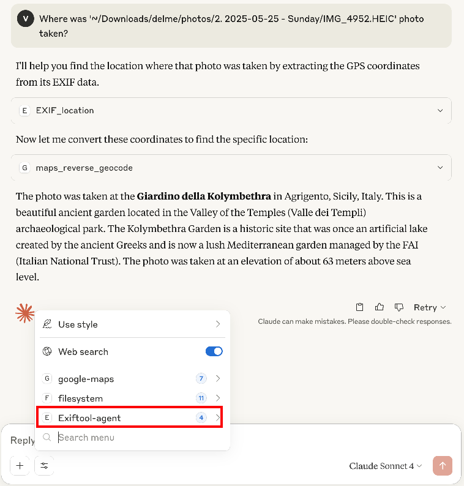

# exiftool-mcp-server

This is an MCP Server (an MCP protocol compatible AI agent) for retrieving EXIF data from images (photos) and videos, using [ExifTool](https://exiftool.org/). This agent was tested with [MCP Inspector](https://modelcontextprotocol.io/docs/tools/inspector) and [Claude Desktop](https://claude.ai/download).

> Note: the `exiftool` copyright belongs to its author, and not to the creators of this AI agent.

## Table of Contents

- [Description](#description)
- [Dependencies](#dependencies)
- [Supported MCP Tools](#supported-mcp-tools)
- [Usage](#usage)
  - [Testing with Claude Desktop](#testing-with-claude-desktop)
    - [When Using Npmjs.org Package](#when-using-npmjsorg-package)
    - [When Code Cloned from GitHub Locally](#when-code-cloned-from-github-locally)
  - [Testing Locally With MCP Inspector](#testing-locally-with-mcp-inspector)
    - [Prerequisites](#prerequisites)
    - [Testing With MCP Inspector](#testing-with-mcp-inspector)
- [Contribution Guidelines](#contribution-guidelines)
- [Security Considerations](#security-considerations)
- [License](#license)
- [Author](#author)

## Description

This project provides a command-line/stdio transport MCP (Model Context Protocol) server that allows clients to retrieve EXIF metadata from image and video files by safely executing the `exiftool` command with specified arguments. It listens for JSON requests on standard input and returns the EXIF data as JSON responses on standard output.

## Dependencies

1. Ensure you have [Node.js](https://nodejs.org/) installed (version 14 or higher recommended).
2. Install [ExifTool](https://exiftool.org/) on your system. This tool is required for extracting metadata.


## Supported MCP Tools:

- **EXIF_all_or_some**: Return all or some EXIF properties. If args are not supplied, return all. The `args` parameter is an optional array of strings representing EXIF property names to return.

- **EXIF_location**: Return GPS-related EXIF metadata. The `args` parameter is an optional array of additional arguments for exiftool.

- **EXIF_timestamp**: Return timestamp-related EXIF metadata. The `args` parameter is an optional array of additional arguments for exiftool.

- **EXIF_location_and_timestamp**: Return both GPS and timestamp EXIF metadata. The `args` parameter is an optional array of additional arguments for exiftool.

The server listens for JSON-RPC 2.0 requests on stdin. 


# Usage

## Testing with Claude Desktop 

### When Using Npmjs.org Package

Use the following entry in the `~/Library/Application Support/Claude/claude_desktop_config.json`

```json
"Exiftool-agent": {
  "command": "npx",
  "args": [
    "-y",
    "exiftool-mcp-ai-agent"
  ]
}
```

### When Code Cloned from GitHub Locally

Use the following development-time entry, in case you have cloned the source code, in Claude's `~/Library/Application Support/Claude/claude_desktop_config.json` (with appropriate repo path change):

```json
"Exiftool-agent": {
  "command": "sh",
  "args": [
    "-c",
    "cd ~/Projects/AI/exiftool-mcp-server && npx node --loader ts-node/esm --no-warnings src/index.ts"
  ]
}
```

### Claude Desktop Integration View


## Testing Locally With MCP Inspector

### Prerequisites

Before testing with the MCP Inspector, ensure the following are installed:

- [Node.js](https://nodejs.org/) (version 14 or higher recommended)
- [ExifTool](https://exiftool.org/)


### Testing With MCP Inspector

1. Clone the github repo at https://github.com/vgribok/exiftool-mcp-server.git.

2. In the repo root, run `npm install`.

3. Start debugging the MCP Inspector in VSCode using the "MCP Inspector with TypeScript Server" launch configuration.

4. In the integrated terminal, watch for output lines containing:

   ```
   Open inspector with token pre-filled:
      http://localhost:6274/?MCP_PROXY_AUTH_TOKEN=...
   ```
  > If the launch.json has auth disabled, then simple point the browser to the http://localhost:6274/, and not to the 127.0.0.1, to work around what seems to be a bug in MCP Inspector (or MCP Proxy).

5. Click the **Connect** button in the MCP Inspector UI to connect to your MCP server.

6. Once connected, click the **List Tools** button to discover all available tools provided by the server.


7. Select a tool from the list to view its input parameters and metadata.

8. Use the UI to send test requests to the selected tool and observe the responses.


9. Experiment with different parameters to explore the capabilities of the MCP server.


## Contribution Guidelines

Contributions are welcome! Please follow these steps:

1. Fork the repository.
2. Create a new branch for your feature or bugfix.
3. Make your changes and commit with clear messages.
4. Submit a pull request describing your changes.

Please ensure your code follows existing style and includes appropriate error handling.

## Security Considerations

- The server strictly validates the `args` parameter to be an array of strings.
- It disallows shell metacharacters such as `;`, `&`, `|`, `` ` ``, `$`, `>`, `<`, and `\` to prevent command injection attacks.
- Always ensure that the input to the server is from trusted sources.

## License

This project is licensed under the ISC License. See the [LICENSE](LICENSE) file for details.

## Author

Vlad Hrybok
